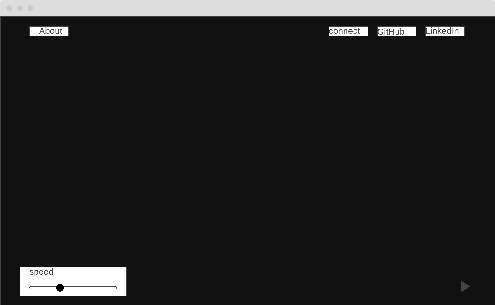

# Satellite Radio

## Background and Overview

Satellite Radio is a data visualizer that fetches asteroid data to inform video and audio across the web page.

## Functionality and MVPs

The webpage will mostly function as a data visualizer. To begin, there will be very few UI elements for the user to ineract with. The page will make a fetch request _once_ for data regarding location, trajectory, and speed of satellites. Afterwards, satellites will be displayed on a canvas in the middle of the page with their current position on the screen being updated on render. This running location total of simulated satellite information (position, velocity, etc) control parameters (amplitude, frequency, etc) on individual voices of a WebAudioAPI synthesizer. The result is something that vaguely resembles [this](https://vimeo.com/512320162), an audio-visual boid simulation except this relies on satellite data.

### MVPS

- Fetch satellite information
- Basic visual representation (simulation) of position of satellites
- Inform WebAudio oscillator with simulated position of satellite
- User has ability to speed up simulation (satellites move very slowly)
- Sparse ui including canvas, about section, and relevant connect to author links

## Wireframes

The layout of the site is very sparse, meant to be more zen than anything. The canvas will stretch the display with only a few points of user interaction. On top will be an about section with contact information on the right. On the bottom is a speed control and play controls (may be mute/unmute and/or volume buttons in future iterations)

Much like the [work](http://neurealm.net/) above, the canvas will incorporate a similar style of pointilism and/or pixel art. The project will exist on a black background with the color white to display stars and green to display satellites and clickable UI elements.

## Architecture and Technology

- Fetch API

  - Fetch API will be used to make requests on page load

- [CelesTrak Orbit API](https://celestrak.com/)

  - While there are many API's that return data on satellite's, this may be the easiest in terms of limiting information
  - Scope of data is mostly limited to name and orbital data

- Web Audio API

  - Will use `OscillatorNode` at large as an audio source

  - Will control oscillator volume using `GainNode`

## Implementation Timeline

### Tuesday 06/01

- Connect fetchAPI to satellite API
- Display basic canvas with pixel stars
- Add relevant links to top of UI

### Wednesday 06/02

- Simulate motion of single satellite across 2d canvas

- Connect single satellite information to WebAudioAPI

### Thursday 06/03

- Add speed control to simulation functionality and UI
- Limit data size of satellite to render audiovisual representation of multiple satellites

### Friday 06/04

- Polish UI

- Add clickable information about satellite

- Polish audio component

## Bonus features

- Satellite is rendered in 3D space using `WebGl` or `Babylon`

- User can limit types of satellite data (active, historical, private interest)

- Polished audio components
