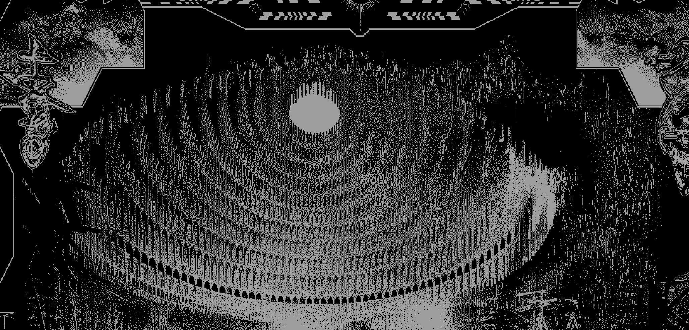

# Satellite Radio

## Background and Overview

Satellite Radio is a data visualizer that fetches asteroid data to inform video and audio across a web page. [Live site](https://satellite-radio.herokuapp.com/).

## About
On webpage load, user's will be prompted to start the visualizer in order for the page to fetch satellite data from [CelesTrak](https://celestrak.com/), initialize Web Audio Audio nodes, and give the user the option to read about the project via an 'About' modal. After fetching data on active satellites via Axios and a lightweight node server, the propagation of individual satellites are approximated using [satellite.js](https://github.com/shashwatak/satellite-js) and rendered on screen using [three.js](https://threejs.org/). The coordinates of 256 satellites are used to control the oscillators' respective pitches based on satellite's distance from the earth. Future iterations of this project will likely see more options for controlling oscillators' pitch, allowing the user to seek and adjust knobs similar to an oscillator or well -- satellite radio.


## Technology Used
- Vanilla JavaScript
- Node.js
- Express
- Axios
- [Satellite.js](https://github.com/shashwatak/satellite-js)
- [CelesTrak Orbit API](https://celestrak.com/)
- [Three.js](https://threejs.org/)
- Heroku

## View

Below is a truncated view of the website's main feature, a 3D canvas object that allows for zooming and panning via mouse input. 


```javascript 
//game_view.js

const animate = (t) => {
      const date = new Date(newActiveClock.elapsed(t).date());
      controls.update();
      requestAnimationFrame(animate);
      line.rotation.y += (1 / 86400) * window.rate; // rotates once a day * rate of playback
      for (let i = 0; i < satRecs.length; i++) {
        satellites.geometry.vertices[i] = satelliteVectorFunc(satRecs[i], date);
        if (i < 256) { // only update audio for first 256 satellites
          this.updateSatelliteOsc(satellites.geometry.vertices[i], i);
        }
      }
      satellites.geometry.verticesNeedUpdate = true;
      renderer.render(scene, camera);
    };
    animate(this.t);
  }

```
## Looking forward
The webpage is meant to be very sparse, there are several means through which users may interact with the site (dragging/zooming animation, adjusting playback speed). In the future, there is room for more features that invite user interaction, most revolving around audio manipulation.

The page makes a fetch request _once_ for data regarding location, trajectory, and speed of satellites. Afterwards, satellites are displayed on a 3D canvas in the middle of the page with their current position on the screen being updated on render. This running location total of simulated satellite information (position, velocity, etc) control parameters (amplitude, frequency, etc) on individual voices of a WebAudioAPI oscillators. 

### MVPS

- Fetch satellite information
- Basic visual representation (simulation) of position of satellites
- Inform WebAudio oscillator with simulated position of satellite
- User has ability to speed up simulation (satellites move very slowly)
- Sparse ui including canvas, about section, and relevant connect to author links

## Wireframes


The layout of the site is very sparse, meant to be more zen than anything. The canvas will stretch the display with only a few points of user interaction. On top will be an about section with contact information on the right. On the bottom is a speed control and play controls (may be mute/unmute and/or volume buttons in future iterations)



Much like the [work](http://neurealm.net/) above, the canvas will incorporate a similar style of pointilism and/or pixel art. The project will exist on a black background with the color white to display stars and green to display satellites and clickable UI elements.

## Architecture and Technology

- Fetch API

  - Fetch API will be used to make requests on page load

- [CelesTrak Orbit API](https://celestrak.com/)

  - While there are many API's that return data on satellite's, this may be the easiest in terms of limiting information
  - Scope of data is mostly limited to name and orbital data

- Web Audio API

  - Will use `OscillatorNode` at large as an audio source

  - Will control oscillator volume using `GainNode`

## Implementation Timeline

### Tuesday 06/01

- Connect fetchAPI to satellite API
- Display basic canvas with pixel stars
- Add relevant links to top of UI

### Wednesday 06/02

- Simulate motion of single satellite across 2d canvas

- Connect single satellite information to WebAudioAPI

### Thursday 06/03

- Add speed control to simulation functionality and UI
- Limit data size of satellite to render audiovisual representation of multiple satellites

### Friday 06/04

- Polish UI

- Add clickable information about satellite

- Polish audio component

## Bonus features

- Satellite is rendered in 3D space using `WebGl` or `Babylon`

- User can limit types of satellite data (active, historical, private interest)

- Polished audio components
